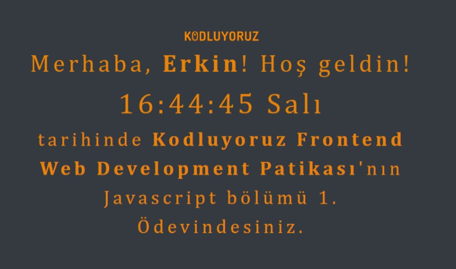

# Saat ve Karşılama Ekranı
Girişte isminizi isteyip sonra bu ismi karşılama ekranına yerleştirerek o anki saati ve günü gösteren bir ekran.




## Installation
Öncelikle projeyi clonelayın.
```
git clone https://github.com/erkinozturk/Javascript-Saat-ve-Karsilama.git
```


## Usage
Projeyi cloneladıktan sonra Visual Studio Code programında açınız.

Linux için:

```
cd Javascript-Saat-ve-Karsilama
code .
```


## Contributing
Pull requestler kabul edilir. Büyük değişiklikler için, lütfen önce neyi değiştirmek istediğinizi tartışmak için bir konu açınız.


## License
[MIT](https://choosealicense.com/)